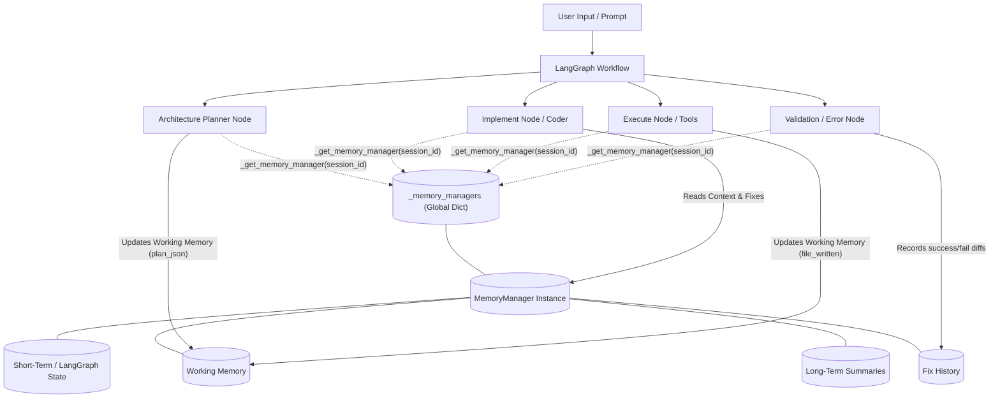
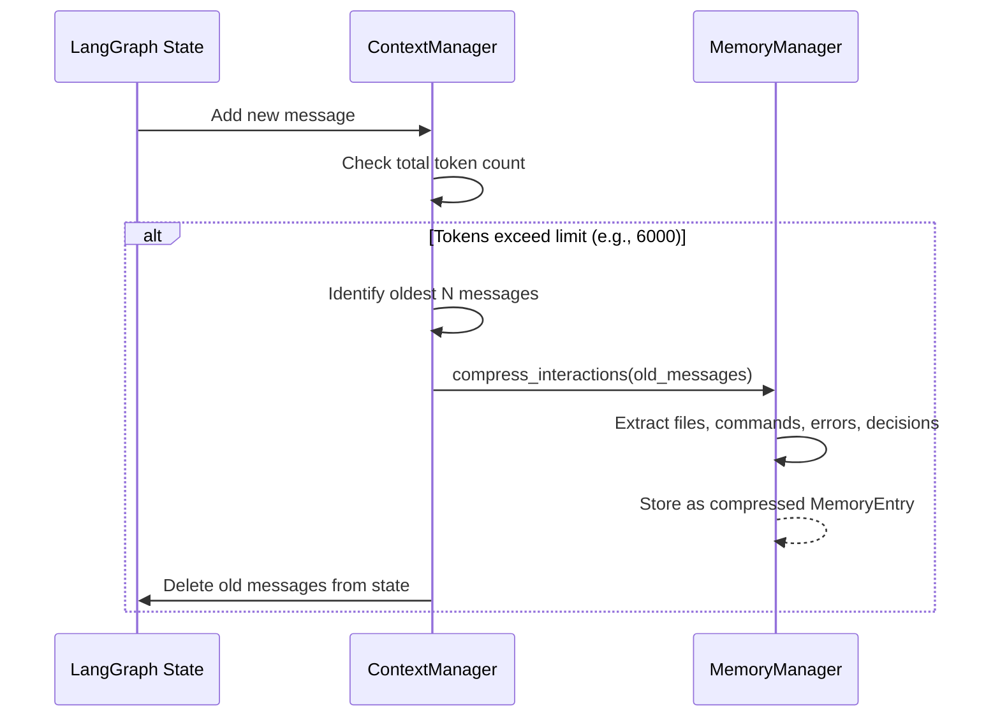

# Agent Memory Architecture

This document explains how the `MemoryManager` is integrated into your LangGraph-based agent workflow. It details where memory is accessed, updated, and how different types of memory flow through the system.

## 1. High-Level Workflow Diagram

This Mermaid diagram shows how your different nodes interact with the global `_memory_managers` dictionary during a session.



## 2. Component Breakdown

Here is a detailed breakdown of how each node in `backend/agent/nodes.py` interacts with the memory system:

### A. Initialization & Access (`_get_memory_manager`)
At the top of `nodes.py`, there is a global dictionary:
```python
_memory_managers: dict[str, MemoryManager] = {}
```
Whenever any node (Planner, Coder, Executor) is triggered, it calls `_get_memory_manager(session_id)`. If the session doesn't have a memory manager yet, one is created and stored in RAM.

### B. Architecture Planner Node
- **Action:** Generates or refines the project plan.
- **Memory Interaction:** Once the plan is generated, it calls `memory.update_working_memory(plan=plan_json)`. 
- **Why:** This ensures that downstream nodes (like the implement node) always have access to the latest architectural blueprint in their prompt context.

### C. Execute Node (Tools)
- **Action:** Runs terminal commands and writes code to the file system.
- **Memory Interaction:** When a `FileWriteAction` or `FileReplaceAction` occurs, it calls `memory.update_working_memory(file_written=action.path)`.
- **Why:** This populates the `active_files` list in working memory, allowing the agent to remember which files it just created or modified so it doesn't get confused about the workspace state.

### D. Validation / Implementation Nodes
- **Action:** Checks for errors (linting, build failures) and writes code to fix them.
- **Memory Interaction:** Uses the `Fix History` engine. When it attempts a fix, it calls `memory.record_fix(file, issue_category, fix_diff, success)`. 
- **Why:** If the agent encounters the same error category again, it can call `memory.get_similar_fixes()` or `memory.get_known_failures()` to retrieve past experiences, avoiding infinite loops of applying the same broken fix.

## 3. The Context Manager & Long-Term Pruning

While `nodes.py` handles Working Memory and Fix History, the **Short-Term** and **Long-Term** memory are managed slightly differently:



When the raw chat history gets too long, `ContextManager` removes the oldest messages from the active prompt to save tokens, but first passes them to `MemoryManager.compress_interactions()`. The Memory Manager uses Regex to extract the core facts and saves them into the Long-Term memory array.

---

> [!WARNING]
> As discussed previously, because the `_memory_managers` dictionary is stored in the active server RAM, **all of this architecture collapses if the server restarts**, or if the system scales to multiple pods. Persistent database storage (PostgreSQL/Redis) is required for production readiness.
